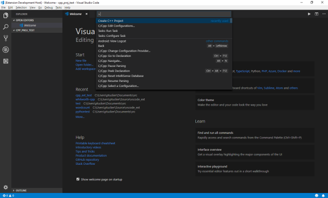
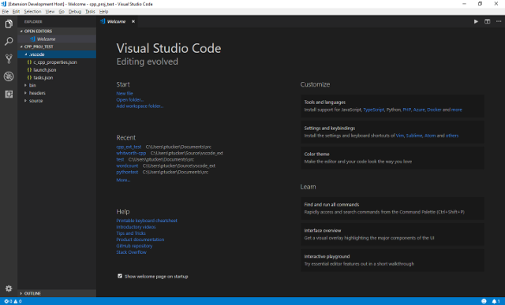

# whitworth-cpp README

Welcome to CS at Whitworth! This extension should help you start your C++ projects in Visual Code.

## Features

The **Whitworth C++ Project** extension creates files and folders for developing C++
applications at Whitworth. It creates three folders:
* **source** is where you will save your C++ source code (e.g. source.cpp).
* **headers** is where you will save your header files (e.g. math.h).
* **bin** is where your application will be built when you compile the program.

The extension also creates three vscode files, in the .vscode folder:
* **c_cpp_properties.json** contains properties for Visual Code to understand C++ source code.
* **tasks.json** defines two Visual Code tasks:
 * **build project** defines how to build your program using the G++ compiler ([Windows MinGW](http://mingw.org/), [Linux/OSX G++](https://gcc.gnu.org/)).

## Requirements

* On Windows, we assume MinGW is installed to C:/MinGW/bin.

## Extension Settings

None

## Known Issues

None at this time

## Release Notes

### 1.0.0

Initial release of whitworth-cpp
